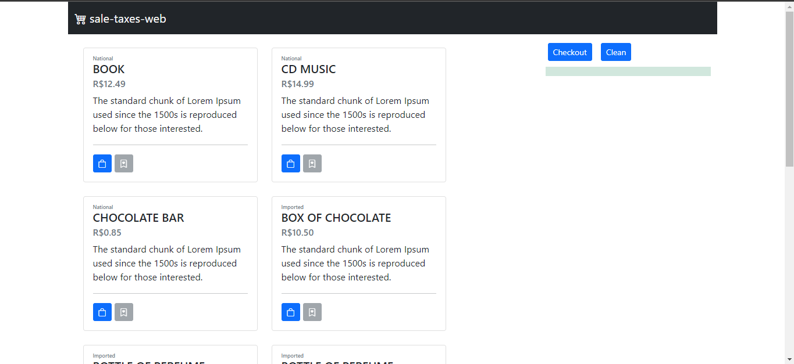

# SaleTaxesWeb

Projeto desenvolvido utilizando [Angular CLI](https://github.com/angular/angular-cli) versão 13.0.4.

Desenvolvimento utilizando a arquitetura padrão recomendada pelo angular.

Foram utilizadas as tecnologias:
* Bootstrap 4
* NgRX - Gerenciamento de Estados

## 💻 Pré-requisitos

Antes de começar, verifique se você atendeu aos seguintes requisitos:
* Ter instalado e ambiente configurado o `Node`
* Ter instalado o `Angular CLI`

## 🚀 Instalando

Acessar o diretório do projeto e executar o comando:
```
npm install
```
## Iniciando Aplicação

Execute `ng serve` para iniciar o servidor. Navegue até `http://localhost:4200`.



